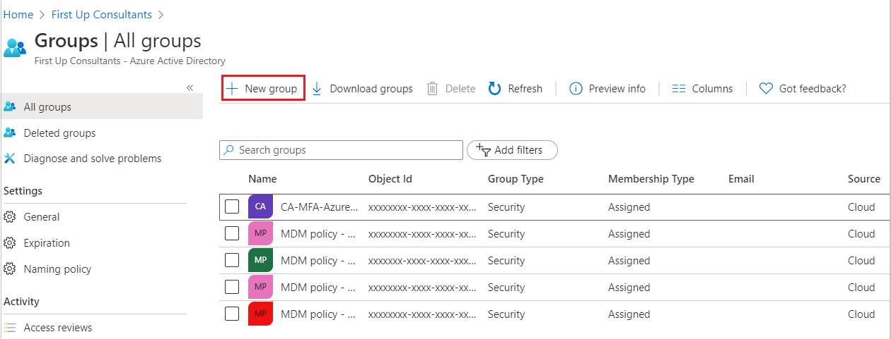
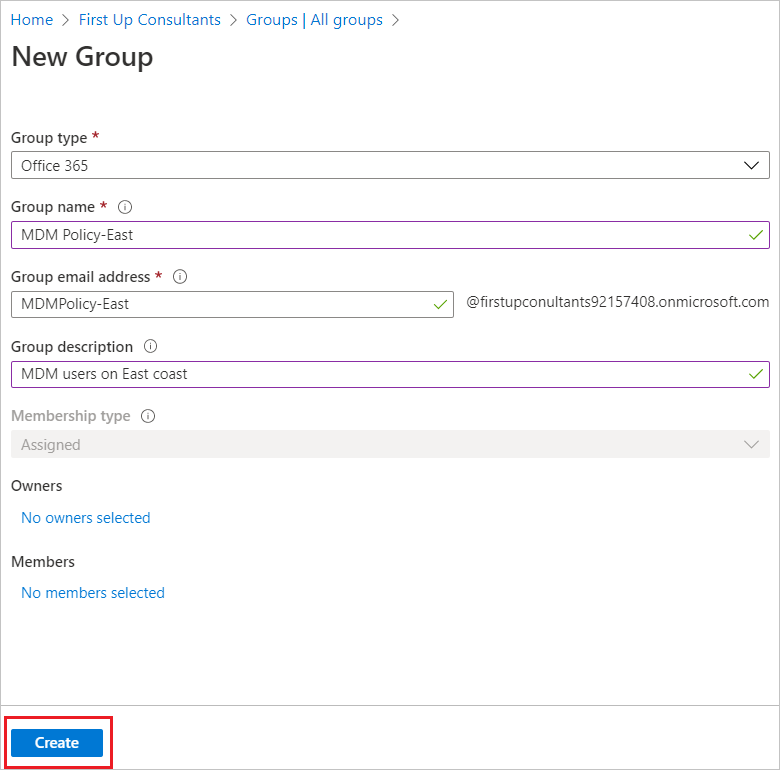
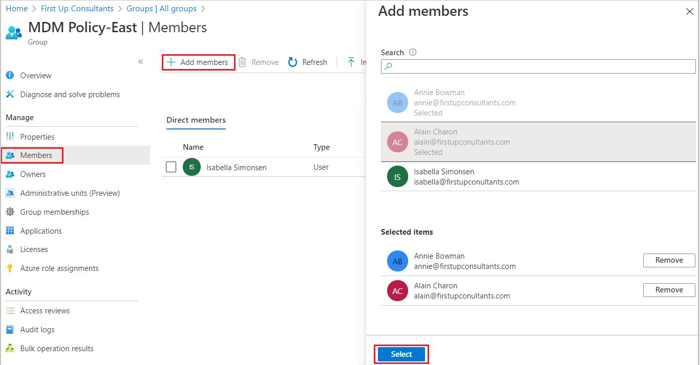
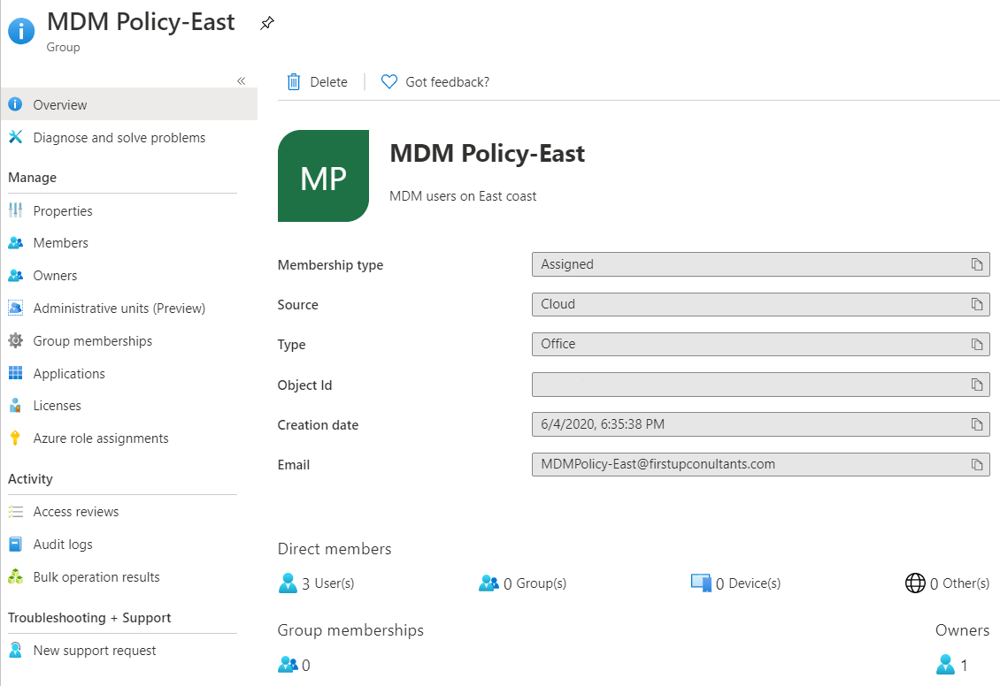

# Create a basic group and add members using Azure Active Directory
You can create a basic group using the Azure Active Directory (Azure AD) portal. For the purposes of this article, a basic group is added to a single resource by the resource owner (administrator) and includes specific members (employees) that need to access that resource. For more complex scenarios, including dynamic memberships and rule creation, see the [Azure Active Directory user management documentation](../enterprise-users/index.yml).

## Group and membership types
There are several group and membership types. The following information explains each group and membership type and why they are used, to help you decide which options to use when you create a group.

### Group types:
- **Security**. Used to manage member and computer access to shared resources for a group of users. For example, you can create a security group for a specific security policy. By doing it this way, you can give a set of permissions to all the members at once, instead of having to add permissions to each member individually. A security group can have users, devices, groups and service principals as its members and users and service principals as its owners. For more info about managing access to resources, see [Manage access to resources with Azure Active Directory groups](active-directory-manage-groups.md).
- **Microsoft 365**. Provides collaboration opportunities by giving members access to a shared mailbox, calendar, files, SharePoint site, and more. This option also lets you give people outside of your organization access to the group. A Microsoft 365 group can have only users as its members. Both users and service principals can be owners of a Microsoft 365 group. For more info about Microsoft 365 Groups, see [Learn about Microsoft 365 Groups](https://support.office.com/article/learn-about-office-365-groups-b565caa1-5c40-40ef-9915-60fdb2d97fa2).

### Membership types:
- **Assigned.** Lets you add specific users to be members of this group and to have unique permissions. For the purposes of this article, we're using this option.
- **Dynamic user.** Lets you use dynamic membership rules to automatically add and remove members. If a member's attributes change, the system looks at your dynamic group rules for the directory to see if the member meets the rule requirements (is added) or no longer meets the rules requirements (is removed).
- **Dynamic device.** Lets you use dynamic group rules to automatically add and remove devices. If a device's attributes change, the system looks at your dynamic group rules for the directory to see if the device meets the rule requirements (is added) or no longer meets the rules requirements (is removed).

    > [!IMPORTANT]
    > You can create a dynamic group for either devices or users, but not for both. You also can't create a device group based on the device owners' attributes. Device membership rules can only reference device attributions. For more info about creating a dynamic group for users and devices, see [Create a dynamic group and check status](../enterprise-users/groups-create-rule.md)

## Create a basic group and add members
You can create a basic group and add your members at the same time. To create a basic group and add members use the following procedure:

1. Sign in to the [Azure portal](https://portal.azure.com) using a Global administrator account for the directory.

1. Search for and select **Azure Active Directory**.

1. On the **Active Directory** page, select **Groups** and then select **New group**.

    

1. The **New Group** pane will appear and you must fill out the required information.

    

1. Select a pre-defined **Group type**. For more information on group types, see [Group and membership types](#group-types).

1. Create and add a **Group name.** Choose a name that you'll remember and that makes sense for the group. A check will be performed to determine if the name is already in use by another group. If the name is already in use, to avoid duplicate naming, you'll be asked to change the name of your group.

1. Add a **Group email address** for the group, or keep the email address that is filled in automatically.

1. **Group description.** Add an optional description to your group.

1. Select a pre-defined **Membership type (required).** For more information on membership types, see [Group and membership types](#membership-types).

1. Select **Create**. Your group is created and ready for you to add members.

1. Select the **Members** area from the **Group** page, and then begin searching for the members to add to your group from the **Select members** page.

    

1. When you're done adding members, choose **Select**.

    The **Group Overview** page updates to show the number of members who are now added to the group.

    

## Turn on or off group welcome email

When any new Microsoft 365 group is created, whether with dynamic or static membership, a welcome notification is sent to all users who are added to the group. When any attributes of a user or device change, all dynamic group rules in the organization are processed for potential membership changes. Users who are added then also receive the welcome notification. You can turn this behavior off in [Exchange PowerShell](/powershell/module/exchange/users-and-groups/Set-UnifiedGroup). 

## Next steps

- [Manage access to SaaS apps using groups](../enterprise-users/groups-saasapps.md)
- [Manage groups using PowerShell commands](../enterprise-users/groups-settings-v2-cmdlets.md)
